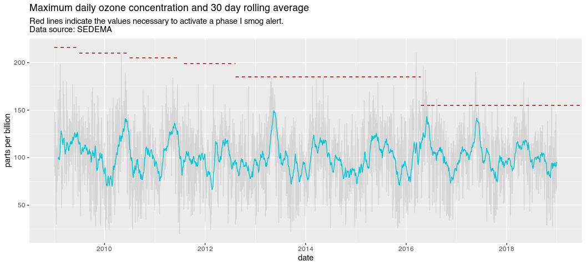

Mexico City Air Quality Data
================
Diego Valle-Jones
February 09, 2024

- [What does it do?](#what-does-it-do)
- [Installation](#installation)
- [Core Functions](#core-functions)
- [Quick Example](#quick-example)

[](https://github.com/diegovalle/aire.zmvm/actions)
[](https://codecov.io/github/diegovalle/aire.zmvm?branch=master)


|              |                                                       |
|--------------|-------------------------------------------------------|
| **Author:**  | Diego Valle-Jones                                     |
| **License:** | [BSD_3](https://opensource.org/licenses/BSD-3-Clause) |
| **Website:** | <https://hoyodesmog.diegovalle.net/aire.zmvm/>        |

## What does it do?

Tools for downloading airquality data for the Mexico City metro area.
This package can download real-time, daily maximum, minimum, or hourly
average data for each of the pollution measuring stations or
geographical zones in the Zona Metropolitana del Valle de México
(greater Mexico City). It also includes the locations of all the
measuring stations and a function to perform inverse distance weighting
modified to work with wind direction.

## Installation

You can always install the development version from GitHub:

``` r
if (!require(devtools)) {
    install.packages("devtools")
}
devtools::install_github('diegovalle/aire.zmvm')
```

To install the most recent package version from CRAN type:

``` r
install.packages("aire.zmvm")
library(aire.zmvm)
```

Note that the version on CRAN might not reflect the most recent changes
made to this package.

## Core Functions

The package core functions:

- `get_station_data` and `get_station_month_data` download pollution,
  wind and temperature data for each of the measuring stations in the
  original units (ppb, µg/m³, etc).
- `get_station_imeca` download pollution values for each station in
  IMECAs
- `get_zone_imeca` download pollution data in IMECAs for each of the 5
  geographic zones of Mexico City
- `get_latest_imeca` download the latest pollution hourly maximums for
  each of the measuring stations.
- `idw360` inverse distance weighting modified to work with degrees,
  useful for wind data

| Function               | Date range     | Units    | Wind, Tmp, RH | Earliest Date | Pollutants                                      | Includes All Stations | Criterion                            |
|------------------------|----------------|----------|---------------|---------------|-------------------------------------------------|-----------------------|--------------------------------------|
| get_station_data       | years          | Original | Yes           | 1986          | SO2, CO, NO2, O3, PM10, PM25, WSP, WDR, TMP, RH | Yes                   | hourly, daily maximum, daily minimum |
| get_station_month_data | 1 month        | Original | Yes           | 2005‑01       | SO2, CO, NO2, O3, PM10, PM25, WSP, WDR, TMP, RH | Yes                   | hourly, daily maximum, daily minimum |
| get_station_imeca      | 1 day          | IMECA    | No            | 2009‑01‑01    | SO2, CO, NO2, O3, PM10                          | No                    | hourly                               |
| get_zone_imeca         | 1 or more days | IMECA    | No            | 2008‑01‑01    | SO2, CO, NO2, O3, PM10                          | Only zones            | hourly, daily maximum                |
| get_latest_imeca       | 1 hour         | IMECA    | No            | Latest only   | Maximum value of SO2, CO, NO2, O3, PM10         | No                    | latest hourly                        |

## Quick Example

``` r
library("aire.zmvm")
library("dplyr")
library("ggplot2")
library("ggseas")

o3 <- get_station_data(criterion = "MAXIMOS", # Can be one of MAXIMOS (daily maximum), 
                                              # MINIMOS (daily minimum), 
                                              # or HORARIOS (hourly average)
                       pollutant = "O3", # Can be one of "SO2", "CO", "NOX", "NO2", "NO", "O3", 
                                         # "PM10", "PM25", "WSP", "WDR", "TMP", "RH"
                       year = 2009:2018) # A numeric vector, the earliest year allowed is 1986
knitr::kable(head(o3))
```

| date       | station_code | pollutant | unit | value |
|:-----------|:-------------|:----------|:-----|------:|
| 2009-01-01 | ACO          | O3        | ppb  |    67 |
| 2009-01-02 | ACO          | O3        | ppb  |    71 |
| 2009-01-03 | ACO          | O3        | ppb  |   112 |
| 2009-01-04 | ACO          | O3        | ppb  |    91 |
| 2009-01-05 | ACO          | O3        | ppb  |    70 |
| 2009-01-06 | ACO          | O3        | ppb  |    71 |

``` r

# Daily max among all base stations
o3_max <- o3 %>% 
  group_by(date) %>% 
  summarise(max = ifelse(all(is.na(value)),
                         NA,
                         base::max(value, na.rm = TRUE))) %>%
  na.omit()

# ozone values at which a contingencia ambiental was declared
# and the dates during which they were valid
# source: http://www.aire.cdmx.gob.mx/descargas/ultima-hora/calidad-aire/pcaa/pcaa-modificaciones.pdf
contingencia <- data.frame(ppb = c(216, 210, 205, 199, 185, 155, 155),
  start = c(2009, 2009.4973, 2010.4973, 2011.5795, 
            2012.6052, 2016.291, 2016.4986),
  end = c(2009.4973, 2010.4945, 2011.4945, 
          2012.6025, 2016.2883, 2016.4959, Inf))
max_daily_df <- tsdf(ts(o3_max$max, start = c(2009,1), frequency = 365.25))
ggplot(max_daily_df,
       aes(x = x, y = y)) + 
  geom_line(colour = "grey75", alpha = .5) +
  stat_rollapplyr(width = 30, align = "right", color = "#01C5D2") +
  #geom_vline(xintercept = 2015 + 183/365) +
  geom_segment(data = contingencia, 
               aes(x=start, y=ppb, xend=end, yend=ppb), color="darkred", 
               linetype = 2)  +
  xlab("date") +
  ylab("parts per billion") +
  scale_x_continuous(breaks = c(2010, 2012, 2014, 2016, 2018)) +
  ggtitle("Maximum daily ozone concentration and 30 day rolling average", 
          subtitle = paste0("Red lines indicate the values necessary to ",
                            "activate a phase I smog alert.",
                            "\nData source: SEDEMA"))
```

<!-- -->
